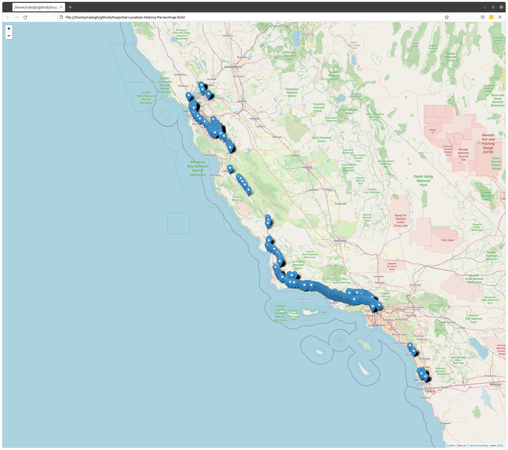

# About

This is a simple tool for analyzing/parsing data from your Snapchat backup. To start, you'll need to download your saved Snapchat data: 

https://support.snapchat.com/en-US/a/download-my-data

Currently, there's two functionalities offered by this program.

## Chat parsing

Snapchat stores your entire chat history in one file, `chat_history.json`. By using `snapchat_chat_parser.py`, you'll convert that file into a set of per-user json files, e.g. if your entire chat history contains messages between Alice, Bob, and Cody, running that script will produce the following files:

* messages-with-alice.json
* messages-with-bob.json
* messages-with-cody.json

To use, run:

```bash
$ python3 snapchat_chat_parser.py
```

## Generating map from location history

Snapchat stores your whole location history in a timestamped format, e.g. a timestamp and coordinate (latitude/longitude) pair; this file is called `location_history.json` in the exported data.

`snapchat_location_history_analyzer.py` simply creates an interactive [Folium](http://python-visualization.github.io/folium/) map out of this data.

To use, run:

```bash
$ python3 snapchat_location_history_analyzer.py
```

And then open the `map.html` that is created.

You'll see something that looks like this:



# Roadmap

- [ ] Save location history to GPX file