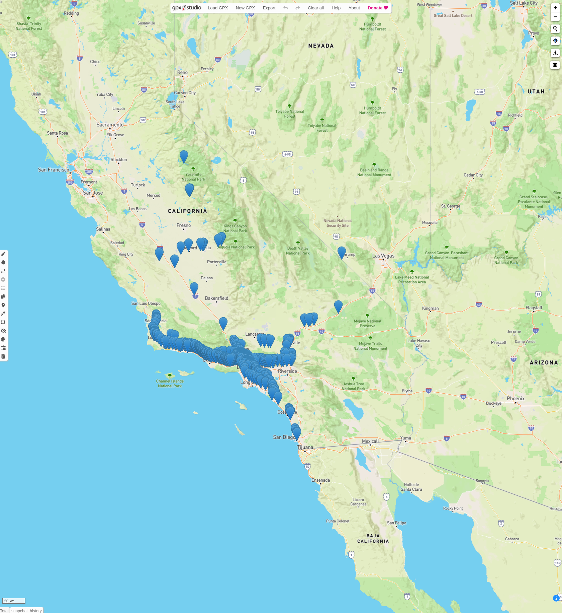

# About

This is a simple tool for analyzing/parsing data from your Snapchat backup. To start, you'll need to download your saved Snapchat data: 

https://support.snapchat.com/en-US/a/download-my-data

Currently, there's two main functionalities offered by this program.

## Chat parsing

Snapchat stores your entire chat history in one file, `chat_history.json`. By using `snapchat_chat_parser.py`, you'll convert that file into a set of per-user json files, e.g. if your entire chat history contains messages between Alice, Bob, and Cody, running that script will produce the following files:

* messages-with-alice.json
* messages-with-bob.json
* messages-with-cody.json

To use, run:

```bash
$ python3 snapchat_chat_parser.py
```

## Map generation

Snapchat stores your whole location history in a timestamped format, e.g. a timestamp and coordinate (latitude/longitude) pair; this file is called `location_history.json` in the exported data.

### Generating Folium interactive map from location history

`snapchat_location_history_analyzer.py` simply creates an interactive [Folium](http://python-visualization.github.io/folium/) map out of this data.

To use, run:

```bash
$ python3 snapchat_location_history_analyzer.py --input-file=location_history.json --output-file=<OUTPUT FILENAME HERE>
```

And then open the `map.html` that is created.

You'll see something that looks like this:


## Generating GPX file from location history

`snapchat_generate_gpx_from_location_history.py` generates a [GPX](https://en.wikipedia.org/wiki/GPS_Exchange_Format) file of your location history, out of "waypoints". This allows you to use your own tools to visualize your location history.

To use, first install [lxml](https://lxml.de/), then run:

```bash
$ python3 snapchat_generate_gpx_from_location_history.py --input-file=location_history.json --output_file=<YOUR GPX FILENAME HERE>
```

Here's a screenshot using gpx.studio:



For troubleshooting, I included the actual GPX [XSD](https://en.wikipedia.org/wiki/XML_Schema_(W3C)) that you can use to verify the generated GPX.

```bash
$ xmllint --schema gpx.xsd <YOUR GPX FILENAME HERE> --noout
```